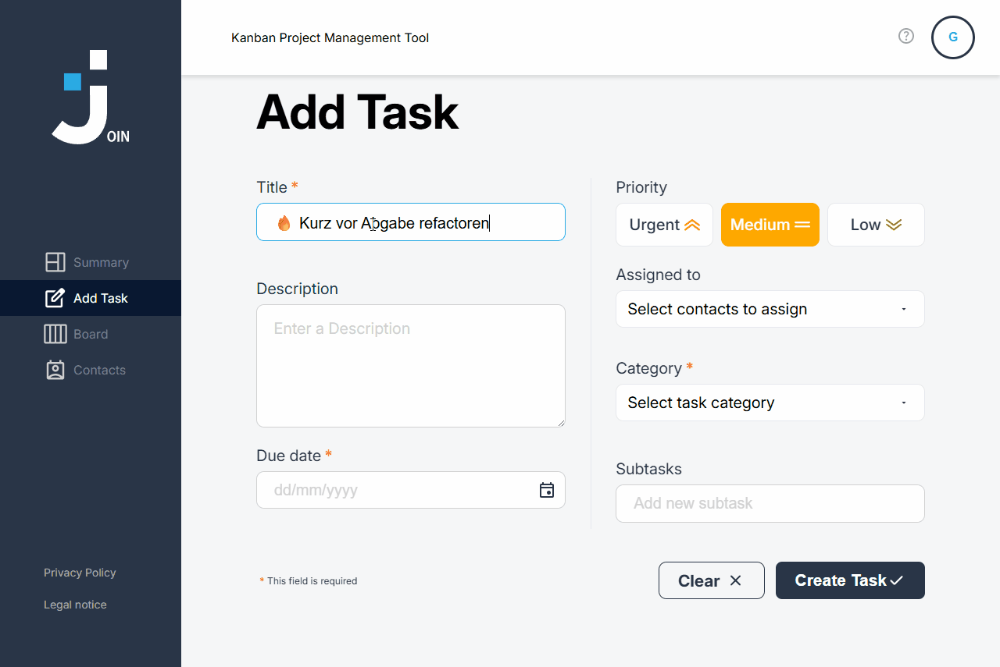

# 🚀 Join Project (Version 1.0)
> Basierend auf der offiziellen Figma-Vorlage v1.0.

Willkommen beim **Join Project**! Dieses Repository ist der zentrale Knotenpunkt für unsere Entwicklung. Unser Ziel ist eine pixelgenaue Umsetzung des Designs bei gleichzeitig hoher Code-Qualität.

---

## 🎥 Project Preview

<p align="center">
  
</p>

---

## 💻 Tech Stack
Wir setzen diese Anwendung mit einem modernen Vanilla-JS-Ansatz um:

* **HTML5** – Semantische Struktur  
* **CSS3** – Styling und Layout (getreu dem Figma-Design)  
* **JavaScript (ES6+)** – Kernlogik und Interaktivität  
* **JSDoc** – Zur standardisierten Dokumentation unseres Codes  
* **Firebase Realtime Database** – Speicherung und Verwaltung der Daten  

---

## ✨ Features

- 📝 Aufgaben erstellen, bearbeiten und löschen  
- 📅 Due Date Auswahl und Eingabelogik  
- 📊 Kanban Board mit mehreren Status-Spalten  
- 🧲 Drag & Drop zwischen Board-Spalten  
- 👥 Kontakte Tasks zuweisen  
- ✅ Subtasks erstellen und verwalten  
- 🔥 Prioritäten setzen (Low, Medium, Urgent)  
- 📱 Responsive Design (Add Task & Board)  
- 🪟 Task Detail & Board Modal  

---

## 🧠 My Contribution

Mein Fokus in diesem Projekt lag auf der Frontend-Entwicklung und UI-Logik.

**Umgesetzte Bereiche:**

- Weiterentwicklung der **Add Task Seite**
- Verbesserung der **responsiven Styles** (Add Task & Board Modal)
- Überarbeitung der **Add Task Logik & Templates**
- Anpassung und Optimierung von **Board Modal Interaktionen**
- Verbesserung des **Due Date Verhaltens**
- Mitarbeit an der **JSDoc Dokumentation**
- Umsetzung eines sauberen **Git Workflows (Rebase, PRs, Branching)**

---

## 📡 Kommunikation & Daily Stand-up
Um synchron zu bleiben und Reibungsverluste zu vermeiden, nutzen wir eine feste Routine.

### 💬 Discord Routine
Jedes Teammitglied postet täglich einen **Stand-up-Status** im entsprechenden Discord-Kanal. 

**Dein Post sollte folgende Punkte enthalten:**

1. ✅ **Zuletzt erledigt:** Was habe ich als Letztes abgeschlossen?  
2. 📅 **Heute:** Woran arbeite ich heute konkret?  
3. ⏳ **Zeitaufwand:** Wie viel Zeit plane ich heute für das Projekt ein?  
4. ❓ **Fragen/Blocker:** Gibt es Probleme oder Fragen, die mich aufhalten?  

---

## 📂 Organisation & Tools

* **Aufgaben-Management:** Trello  
  * Aufgaben aus dem Backlog wählen  
  * Fortschritt über "In Progress" tracken  

* **Kommunikation:** Discord  
  * Regelmäßige Abstimmung im Team  

---

## 🌿 Branching-Strategie

Damit unser Code stabil bleibt, halten wir uns an dieses System:

1. **Feature Branches:** Entwicklung erfolgt in eigenen Branches  
2. **Tester Branch:** Integration und Testing aller Features  
3. **Main/Production:** Finaler stabiler Stand  

> [!IMPORTANT]
> **Kein direktes Mergen in `main`!**  
> Änderungen werden zuerst im `tester` integriert.

---

## 🚀 Erste Schritte

```bash
git clone https://github.com/Ironhyde51/Join.git
cd Join
